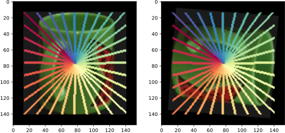

# Learn Continuous Rotation Canonicalization with Radial Beam Sampling 

This is the official GitHub repository for our paper: 
**Learn Continuous Rotation Canonicalization with Radial Beam Sampling**.
We propose a maximal continuous angle regressor using radial beam sampling, which is able to canonicalize arbitrary center-rotated input images.
We call our model **BIC** (Radial-Beam-based Image Canonicalization):


We provide three different interfaces:
- [Radial Beam Sampling](#radial-beam-sampling)
- [BIC Training](#bic-training)
- [BIC Interference](#bic-interference)

Generally, we use Python 3.8.

## Radial Beam Sampling



We provide a notebook [here](./radialbeamsampling.ipynb), which pre-processes 
the dataset COIL100 by adding radial beam samples of each image.
This can be used to more thoroughly understand the technical details
behind our new sampling technique.
This notebook can be used plug-and-play, i.e., all required packages
are installed in the first cell.

## BIC Training

We provide a training routine [here](./call.py).
For instance training with 8 beams can be done via
```
python call.py --num_beams=8
```
The following parameters can be considered:

Argument | Datatype | Range | Default | Description
---|---|---|---|---
num_beams | int | 4, 8, 16, 32, etc. | 16 | cardinality of the beam set
dataset | str | fashion_mnist, cifar10, coil100, lfw | coil100 | the dataset identifier string
beam_length | int | recommendation: fashion_mnist: 14, cifar10: 16, coil100: 64, lfw: 125 | 64 | the beam length (D)
learning_rate | float | - | 0.0001 | the learning rate for the optimizer
context | bool | True/False | True | whether or not to use the context node
continuous | bool | True/False | False | whether or not to use continuous rotations
gcn_layers | int | >0 | 3 | number of GCN layers
batch_size | int | >0 | 128 | the size of one batch of data for training
hidden_dims | int | >0 | 128 | the size of the latent space
train_steps | int | >0 | 4094 | the number of training steps
prior | str | off, linear, full | off | Toeplitz prior

After training the final model is stored in `./model/{dataset}.h5py`.

## BIC Interference

We provide a set of inference notebooks visualizing different statistics and outputs of the trained models.
- In this [notebook](./experiment_downstream.ipynb) illustrates the performance comparison using different inputs for the downstream model.
- In this [notebook](./experiment_similarity.ipynb) the similarity matrix is plotted.
- In this [notebook](./experiment_stability.ipynb) we test for geometric stability w.r.t. translations.
